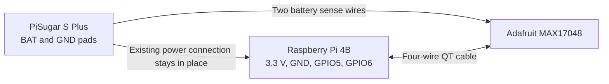

# Battery gauge for Niko's HaLow Pi

For Raspberry Pi 4B + PiSugar S Plus + OSOYOO HDMI35 V2.0.

The sensor connects to **both boards**: it measures the battery at the PiSugar's BAT/GND pads and sends readings to the Pi over two GPIO data wires. The PiSugar continues to charge the battery and power the Pi through its existing connections.

This is a prepared installation guide. The sensor is not installed, its bus has not been enabled, and its readings have not been verified on hardware. The Pi's existing Mum`
| Two short insulated wires, roughly 26–28 AWG | Low-current battery sense connections between PiSugar and gauge. |
| Heat-shrink, insulation and a small nonconductive mount | Protect connections and secure the gauge. |
| Multimeter and soldering equipment | Check polarity and make the two sense connections. |

Prices exclude shipping and tax. If the screen blocks access to a required Pi header pin, use an appropriate GPIO breakout/splitter. Check mechanical clearance with the screen's rigid HDMI adapter before choosing a stacking header.

## Connections

**Physical pin numbers below count positions on the Pi's 40-pin header. They are not BCM GPIO numbers.** For example, physical pin 29 is BCM GPIO5. Use the Pi's marked pin 1 and [official GPIO diagram](https://www.raspberrypi.com/documentation/computers/raspberry-pi.html#gpio) to establish orientation; the underside view is mirrored.

| From | To on the Adafruit MAX17048 | Role |
|---|---|---|
| PiSugar **BAT** pad, battery positive | **BAT** pad | Measures the actual battery, approximately 3.0–4.2 V in normal use |
| PiSugar **GND** pad | **GND** pad | Battery measurement ground |
| Pi physical **pin 1**, **3.3 V** | **VIN**, QT cable red | Sets the data-interface voltage; do not use 5 V |
| Pi physical **pin 39**, **GND** | **GND**, QT cable black | Shared data-interface ground |
| Pi physical **pin 29**, **BCM GPIO5** | **SDA/SDI**, QT cable blue | Data on our dedicated software I2C bus |
| Pi physical **pin 31**, **BCM GPIO6** | **SCL**, QT cable yellow | Clock on our dedicated software I2C bus |

Physical pin 17 is another 3.3 V connection if pin 1 is inaccessible. Both sensor ground connections share the same electrical ground; one can use the GND solder pad and the other the QT connector. Follow pin labels and cable documentation rather than trusting colors on third-party cables.

The PiSugar manufacturer labels **GND as position 1** and **BAT as position 2** in its [S Plus board drawing](https://cdn.pisugar.com/img/PiSugarSPlus240705.jpg). These are drawing callouts, not Pi header pin numbers. Compare your actual board with the drawing before soldering. Do not substitute the PiSugar's USB input or 5 V output pads for BAT.



Use the sensor's BAT/GND pads for the two sense wires and leave its two larger battery JST sockets empty. This connects the sensor in parallel with the battery; the Pi's operating current does not pass through the gauge board. There is no need to cut the existing battery power wires or solder directly onto the battery pouch or cell tabs.

## Why these GPIO pins

The PiSugar Auto switch is ON. It uses **BCM GPIO3 / physical pin 5**, which is also the Pi's usual I2C clock. Using the standard I2C pins while retaining Auto would cause a conflict. [PiSugar documents this restriction](https://docs.pisugar.com/docs/product-wiki/battery/pisugar-s-series).

Instead, this guide assigns software I2C to **GPIO5 and GPIO6**. I checked this Pi on 2026-09-28: both pins were unused inputs with no kernel consumer. The touchscreen currently uses GPIO7, 9, 10, 11 and 25. GPIO3 remains dedicated to the existing PiSugar input-power detection. No other device should be added to GPIO5/6 using a different function.

The Adafruit breakout already has I2C pull-up resistors. Keep the wires short; no extra pull-ups are needed for this single short connection. The guide uses a conservative software clock setting.

## Assembly

1. Shut down the Pi normally. Disconnect the PC USB-C cable and all external charging/power cables, and turn the PiSugar off.
2. **The BAT pad can remain live with the PiSugar switch OFF. Physically disconnect the battery before soldering to its board.** If your pack has soldered leads and no detachable connector, pause the soldering step and provide a close-up of the actual board so the connection method can be adapted. Do not cut both live battery wires together or solder onto the pouch itself.
3. With the battery disconnected, solder a short sense wire from PiSugar BAT to gauge BAT and another from PiSugar GND to gauge GND. Insulate exposed joints and add strain relief. A polarized removable connector in these two sense wires is optional.
4. Plug the four-wire QT cable into the sensor and connect its female sockets to the Pi pins in the table. Leave the gauge's INT and QStart connections unused.
5. Inspect for solder bridges and confirm the BAT wire goes only to the gauge's BAT input. **Battery positive must never go directly to a Pi GPIO, 3.3 V pin, or the gauge's VIN connection.**
6. Reconnect the battery while keeping exposed conductors insulated. Before powering the Pi, measure gauge BAT relative to GND: it must have positive polarity and match the single-cell battery voltage, normally about 3.0–4.2 V. A negative voltage, about 5 V, or a voltage above the cell's 4.2 V maximum means stop and correct the connection.
7. Secure the gauge so its underside cannot touch the PiSugar, Pi, or screen circuitry. Power the Pi normally, leaving the PiSugar Auto switch ON.

## Software setup after assembly

These instructions are for this Pi's current configuration. The bus and reader are deliberately not enabled before the sensor is fitted. The battery reader supplied with this guide needs only the Pi's existing Python 3; no internet package installation is required.

Back up `/boot/firmware/config.txt`. Under its active `[all]` section, add this line once:

```ini
dtoverlay=i2c-gpio,bus=30,i2c_gpio_sda=5,i2c_gpio_scl=6,i2c_gpio_delay_us=5
```

Leave the existing display, SPI, USB and PiSugar settings intact. Do **not** enable the standard `i2c_arm` bus on GPIO2/3. Bus 30 was unused when checked; the existing HDMI buses were 20 and 21. If the hardware configuration changes, check availability again.

The system already loads `i2c-dev` for HDMI control. Reboot normally after adding the overlay, then confirm:

```bash
ls -l /dev/i2c-30
```

Copy the accompanying `read-max17048.py` file into `/home/niko/` on the Pi and run:

```bash
sudo python3 /home/niko/read-max17048.py --bus 30
```

It reads only address **0x36**, validates the chip-family version, and prints battery voltage, estimated percentage and estimated rising/falling trend. It does not reset the gauge, change charging settings, switch power, or shut the Pi down. A missing sensor produces an error rather than a fabricated 0% reading.

Check the reported voltage against the multimeter before using the percentage. Allow the estimate to settle, then observe normal discharge and charging with power plugged into the **PiSugar's charging port**. Once those readings are verified, the reader can be integrated into the existing status console. No automatic low-battery shutdown threshold should be enabled until readings have been checked with this battery under load.

## What this sensor does and does not report

The MAX17048 supplies a **model-based percentage estimate**, voltage and an estimated rate of charge change. It does not measure charging current. The existing PiSugar GPIO signal independently indicates external input power.

An honest console can show percentage, voltage, “external input connected/disconnected,” and “battery rising/falling.” A “charging” indication based on that trend must be labeled inferred; a steady estimate does not prove a full battery or absence of charging. A definitive current-based charging/discharging indication would require an additional bidirectional current sensor in the battery path.

## Troubleshooting

| Result | Check |
|---|---|
| `/dev/i2c-30` missing | Overlay spelling, active `[all]` section, reboot, and `i2c-dev` |
| Sensor unavailable / I/O error | BAT and GND, SDA/SCL order, 3.3 V VIN, and common ground |
| Sensor has 3.3 V VIN but will not respond | The MAX17048 itself needs battery voltage at BAT; VIN alone does not power the gauge chip |
| Reading differs greatly from multimeter | Correct BAT pad, solder joints and ground; stop relying on the estimate until resolved |
| Battery trend uncertain with charger connected | Input-power detection and actual battery charging are different measurements |

## Manufacturer references

- [PiSugar S/S Plus pads, battery voltage and Auto-switch behavior](https://docs.pisugar.com/docs/product-wiki/battery/pisugar-s-series)
- [Adafruit MAX17048 pinout and power arrangement](https://learn.adafruit.com/adafruit-max17048-lipoly-liion-fuel-gauge-and-battery-monitor/pinouts)
- [Adafruit PCB schematic files](https://github.com/adafruit/Adafruit-MAX17048-PCB)
- [Analog Devices MAX17048 characteristics](https://www.analog.com/en/products/max17048.html)
- [Raspberry Pi software I2C overlay parameters](https://github.com/raspberrypi/firmware/blob/master/boot/overlays/README)
- [Adafruit register conversions used to cross-check the reader](https://github.com/adafruit/Adafruit_CircuitPython_MAX1704x/blob/main/adafruit_max1704x.py)
